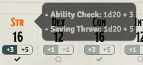
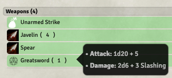
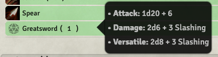
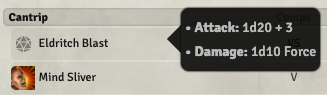
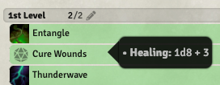
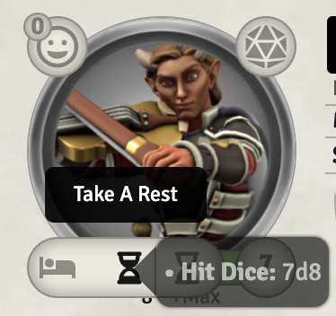
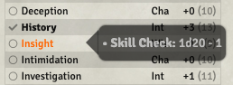
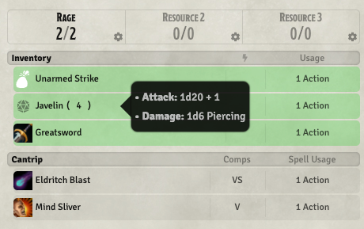

A [FoundryVTT](http://foundryvtt.com/) module that shows dice and bonus information when hovering over
an item/spell/ability/skills/etc. in an actor sheet.

<b>Only works with the D&D5E system</b>

This is useful for those who:
* Want a quick lookup of what will be rolled for a particular attack, check, save, etc.
* Want to roll physical dice, but still maintain all the convenience that Foundry provides.

Tooltips are provided for the following areas of the character sheet:

|Hover Over|Displays|Sample Tooltips|
|---|---|---|
|Ability|Ability Check Saving Throw||
|Item|Attack Roll Damage Roll Versatile Damage Healing Roll Save DC|    |
|Short Rest|Remaining Hit Dice||
|Skill|Skill Check||

Favorites in the Tidy5e sheet also have tooltips.

This has been tested with the following sheets:
* Default 5e Character Sheet
* Default 5e NPC Sheet
* Sky's Alternate 5e Sheet
* Tidy 5e NPC
* Tidy 5e Sheet

Your mileage may vary with other sheets.

Localization support is provided.  Current supported languages:
  - English
  - Portuguese (Brazil)

Pull requests are welcome for other languages.

# Installation

## Recommended

1. Go to Foundry's Setup screen
1. Go to the "Add-On Modules" tab
1. Press "Install Module"
1. Paste `Dice Tooltip - DnD5e` into the text field
1. Press "Install"

## Alternative

1. Download [this zip file](https://github.com/trev33b/dice-tooltip2/raw/master/dist/dice-tooltip2.zip)
2. Extract it into the `<FoundryVTT directory>/data/modules`-folder

# Compatibility

Only Firefox & Chrome are supported.

# Attribution & History

This module was originally written by Steffan Poulsen (https://github.com/SteffanPoulsen/dice-tooltip).

His work appeared to be broken with the release of Foundry 0.8 (new Dice API) and updates to the Tidy 5e Sheets 
and it didn't look like it was going to get fixed anytime soon.  So I forked his
work to this location, fixed those main issues, plus make several enhancements
to the presentation of the tooltip and the code itself.
